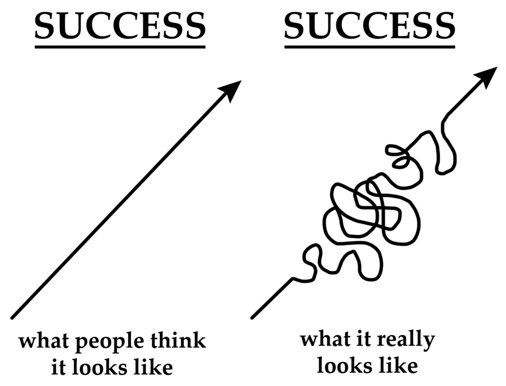

שיטת הקצוות אומרת שאתה עובד על כמה פרויקטים.
בכל פעם אתה מנסה להתקדם בפרויקט מסויים.
אבל לא מתבאס על שום בעיה.
אתה רק 'מחזיק קצוות' ומנסה להתקדם במה שאפשר.
זה לא נורא להתקע. העיקר שאתה זוכר את הקצוות ומנסה להתקדם.

